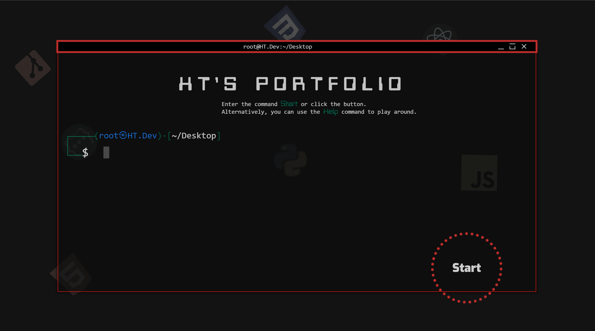
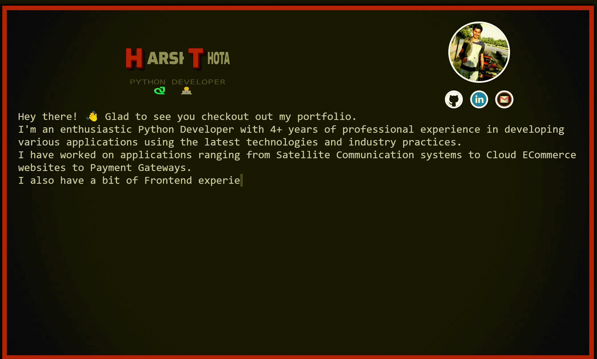
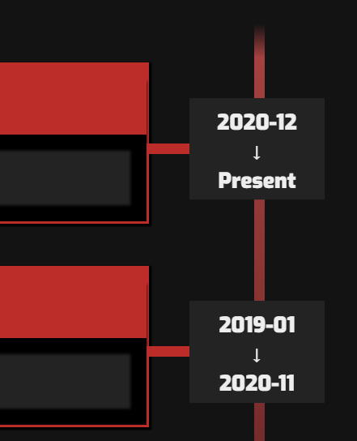
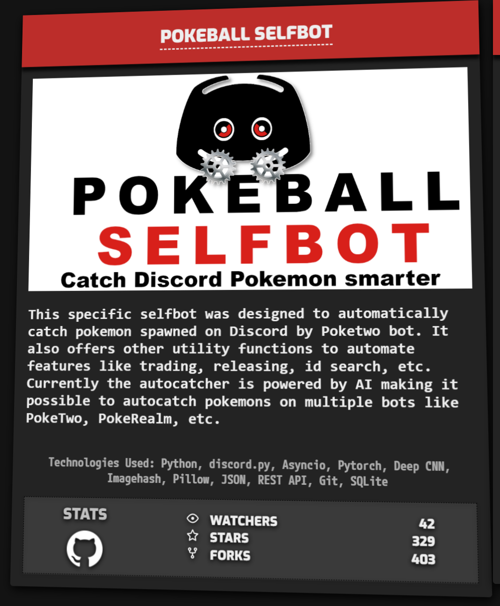
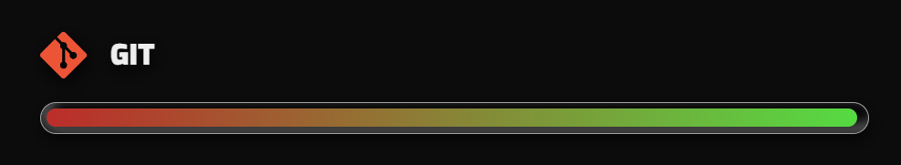

# 🚀 HT Developer Portfolio 🚀

Welcome to my developer portfolio website, built using SvelteKit and PocketBase. The website showcases my skills, projects, and experiences as a developer.

You can access the live website [here](https://ht-dev.vercel.app/).

## 🌟 Features

- Modern and responsive design
- Interactive and user-friendly UI
- Dynamic content fetched from PocketBase database
- Easy to update and maintain
- Admin Panel which redirects to PocketHost

<h3>🔥 Highlights</h3>

Some personal favorite quirks I added which you might wanna use in your own projects:

- On Desktop screens, there is an interactive bash Terminal I made from scratch just to play around.

- About section has a Typewriter Animation. Skills are displayed as a Word Cloud.

- On Desktop screens, the Experience and Acheivements sections have a Timeline created using CSS pseudo-elements.

- Projects section features Tiltable GitHub Cards.

- Multicolor Progressbar to display Skill Proficiency.

## 🛠️ Technologies Used

- [SvelteKit](https://kit.svelte.dev/)
- [PocketBase](https://pocketbase.io/)
- [Vercel](https://vercel.com/)
- [Pockethost](https://pockethost.io/)

## 🚀 Deployment

The website is deployed using [Vercel](https://vercel.com/) and the database is hosted on [Pockethost](https://pockethost.io/). To deploy the website:

1. Clone the repository
2. Set up a PocketHost account and create a new database
3. Update the `.env` file with your relevant credentials
4. Deploy the website to Vercel

## 🖥️ Local Development

To run the website locally:

1. Clone the repository
2. Install dependencies using `npm install`
3. Update the `.env` file with your relevant credentials
4. Start the development server using `npm run dev`

### 🧪 Running Tests

To run the test suite:

1. Ensure dependencies are installed: `npm install`
2. Run all tests: `npm test`
3. Run tests in watch mode: `npm test -- --watch`

All tests are located in the `svelteapp/tests/` directory, organized to mirror the source code structure in `svelteapp/src/`.

## 🤝 Contributing

Contributions, issues, and feature requests are welcome. Feel free to check out the [issues page](https://github.com/hyperclaw79/ht.dev/issues) if you want to contribute.

## 📝 License

This project is licensed under the [MIT License](https://opensource.org/licenses/MIT).
